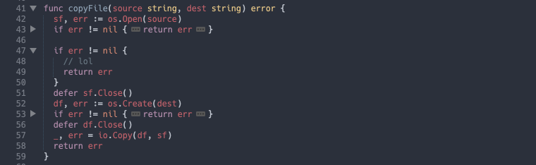

# stopfmt

Whenever I've programmed in Go I've gotten annoyed by the fact that `gofmt` makes my `if err != nil { return }` stanzas take up three whole lines. `stopfmt` undoes `gofmt`'s evil and automatically folds away the newlines in short if statements so you can read your code how you like without your coworkers or `gofmt` noticing.

I also threw in a command I've had in my personal [SublimeTect](https://github.com/trishume/SublimeTect) repo for a while which lets you toggle folding away the bodies of functions so you can get all the benefits of header/interface files in languages without them, without having to write them!



## How to use

Folding short `if` statements in Go files on load is enabled by default but if you write your own if statements and want them folded, or want to toggle folding, you need to bind keyboard shortcuts of your choice to the folding commands. You can do this by using the "Preferences > Key Bindings" menu item to open your key bindings file and adding lines like these but with your choice of shortcut:

```js
{ "keys": ["ctrl+,"], "command": "fold_short_ifs" }, // toggle folding short if statements, meant for Go
{ "keys": ["ctrl+b"], "command": "fold_function_bodies" }, // toggle folding function bodies
```

Pressing either of these keybinds while something remains to be folded will fold that thing, pressing them when everything is folded will unfold all its folds.

## How to configure

You can create a `stopfmt.sublime-settings` file in your `User` package which overrides the following settings:

```js
{
  // Maximum line length for a folded if statement to be and still fold
  "max_line_length": 100,
  // Automatically run fold_short_ifs when a Go file loads
  "auto_fold_go": true,
}
```

## The fold icon is too bright

The color of the folded code icon is controlled by your theme, and you might find it too blatant for this use case. You can fix it by making your own tweaks to your favorite color scheme and modifying the `fold_marker` global.

1. Use the `UI: Select Color Scheme` command to see what your current color scheme is
1. Use `View Package File` and then search for your scheme to open it
1. Make a file in your `User` package with a modified name like `FancyScheme-tristan.sublime-color-scheme` and copy the contents
1. If your theme is a `.tmTheme` file, run the `Convert Color Scheme` command (either variable style is fine) to make a `.sublime-color-scheme` version
1. Set the `fold_marker` global in the `globals` to the color you want, probably some grey or background-y color taken from elsewhere in the color scheme.
1. Use the `UI: Select Color Scheme` command to select your modified color scheme to use

Protip: This is a handy thing to have anyways, if something doesn't highlight how you like you can use ctrl+shift+p to find out what it's scope is and modify your theme to highlight it how you want!
